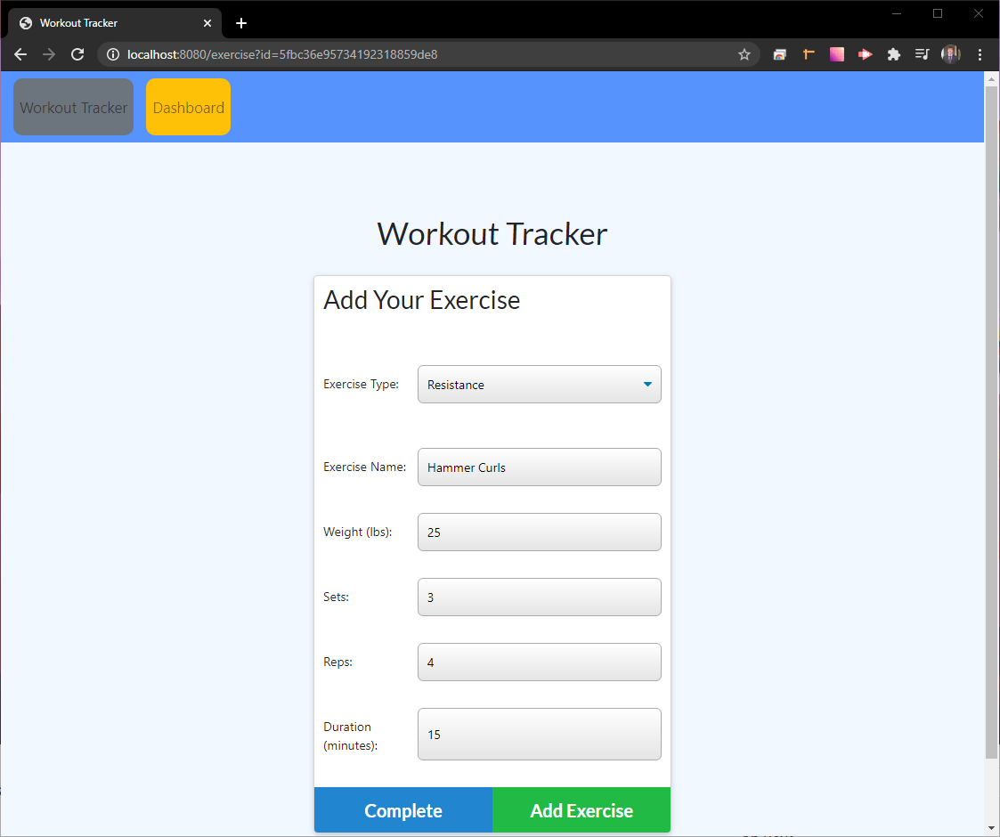
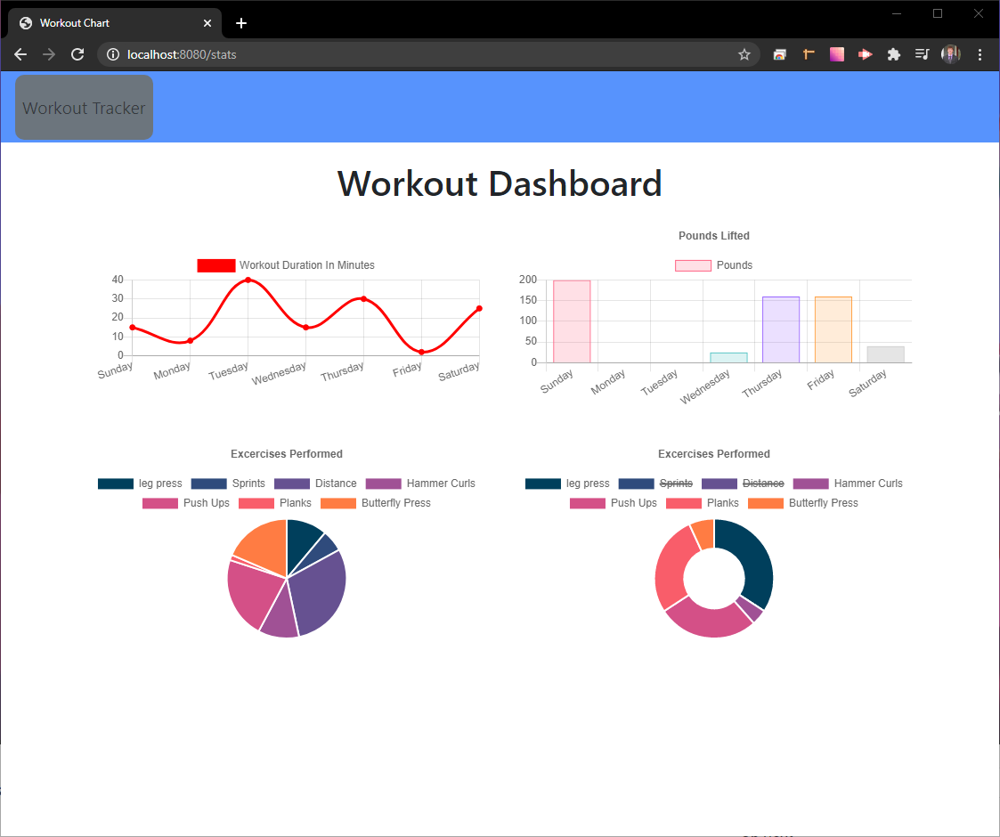

# Workout-Tracker

## Description:
This application allows the user to keep track of various workouts and displays the data over a weeks time and visually displays the results through a series of graphs.

# Table of Contents

- [Description](#description)
- [Installation](#installation)
- [Technologies](#technologies)
- [Usage](#usage) 
- [Contributing](#contributing)
- [Test](#test)
- [Credits](#credits)
- [License](#license) 
- [Questions](#questions)

## Installation:
The user must have a valid internet connection.

## Technologies: 

- HTML
- CSS
- JavaScript
- Express
- MongoDB
- Mongoose

## Screenshots

Main Page

Adding an Ecercise

Exercise Dashboard

## Usage:
The user will first enter a workout, where they decide between a 'cardio' or 'resistance' excercise and then enter information into the respective fields. Once the user finished entering the data for their planned exercise, they can either add another exercise to their workout or complete that workout. The user can enter multiple Exercises per workout and multiple workouts per day if they wish. The user can even continue off of a previous workout with the `continue workout` button. Finally, the user can navigate to their Dashboard to see their exercise results over the past week through a series of graphs.

## Contributing:
Steve Knapp

## Test:
No testing parameters were implemented In the initial build of this application. Proper testing procedures are planned for a future development cycle.

## Credits:
Steve Knapp

## License:
For more information about the License, click on the link below.
    
- [License](https://opensource.org/licenses/)
## Questions:
    Please contact me about this program using the following link: 
- [GitHub Profile](https://github.com/Stovencrantz)
For additional questions please reach out to my email at: sknapp143@gmail.com.
    Here is a video on how to work the application.
- [GitHub Repository](https://github.com/Stovencrantz/Workout-Tracker)

- [Deployed Application](https://workout-tracker-sk.herokuapp.com/)
